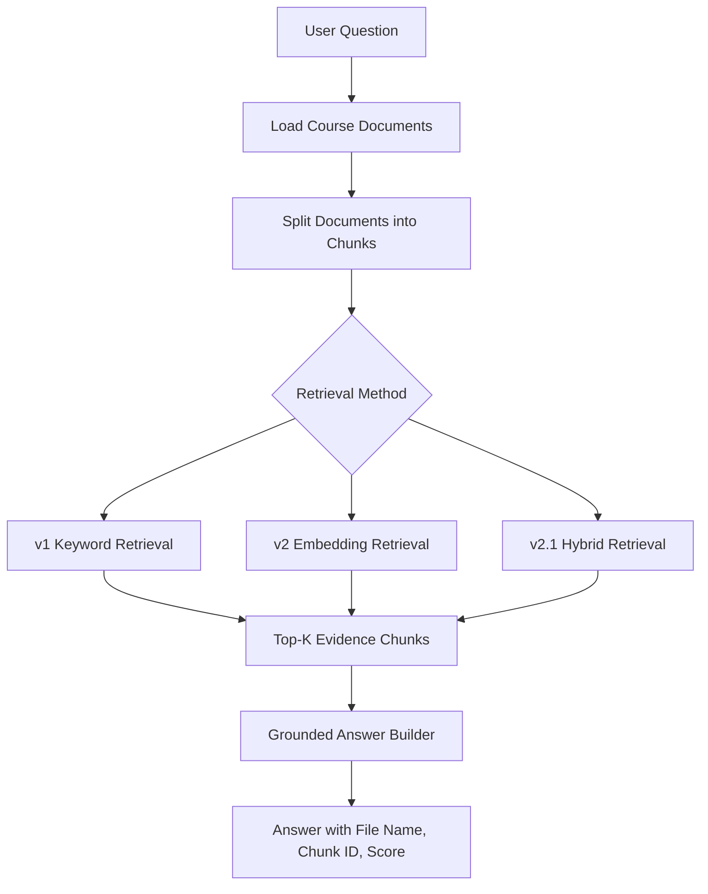
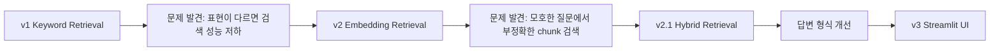

# Course Study RAG Tutor

수업자료와 개인 학습 노트를 기반으로 질문과 관련된 근거 chunk를 검색하고, `file_name`, `chunk_id`, `score`와 함께 답변을 제공하는 RAG 기반 학습 도우미입니다.

이 프로젝트는 Keyword Retrieval → Embedding Retrieval → Hybrid Retrieval → Streamlit UI 순서로 발전시키며, RAG 시스템의 핵심 흐름인 문서 로딩, chunking, retrieval, evidence trace, grounded answer를 직접 구현한 프로젝트입니다.

---

## 1. Project Overview

Course Study RAG Tutor는 Markdown/TXT 형식의 수업자료를 읽고, 사용자의 질문과 관련된 문서 조각(chunk)을 검색한 뒤, 검색된 근거를 바탕으로 답변을 구성하는 RAG 학습 프로젝트입니다.

이 프로젝트는 처음부터 완성형 AI 챗봇을 만드는 것이 아니라, RAG 시스템의 기본 구성 요소를 단계적으로 직접 구현하고 개선하는 것을 목표로 했습니다.

구현 과정은 다음과 같이 발전했습니다.

- v1.0: 외부 LLM API나 딥러닝 모델 없이 Keyword Retrieval 구현
- v2.0: `sentence-transformers` 기반 Embedding Retrieval 추가
- v2.1: embedding score, keyword score, domain boost score를 결합한 Hybrid Retrieval 적용
- v3.0: Streamlit UI를 추가하여 질문, 답변, 검색 근거를 한 화면에서 확인 가능하도록 개선

---

## 2. Why I Built This

AI 서비스에서 중요한 것은 단순히 답변을 생성하는 것이 아니라, 사용자가 답변의 근거를 확인할 수 있도록 만드는 것이라고 생각했습니다.

이 프로젝트에서는 다음 역량을 보여주는 데 집중했습니다.

- 문서를 검색 가능한 단위로 나누는 능력
- 질문과 관련된 근거를 찾는 검색 파이프라인 구현
- 검색 결과에 `file_name`, `chunk_id`, `score`를 함께 표시
- 검색 방식의 한계를 분석하고 개선하는 과정
- Keyword Retrieval에서 Embedding Retrieval, Hybrid Retrieval로 발전시키는 구조 설계
- CLI 기반 실행을 Streamlit UI로 확장하여 시연 가능성 개선

---

## 3. Key Features

| Feature | Description |
|---|---|
| Document Loading | `data` 폴더의 Markdown/TXT 문서 로딩 |
| Chunking | Markdown heading 기준으로 제목과 본문을 하나의 chunk로 분할 |
| Keyword Retrieval | 질문과 chunk의 단어 겹침 기반 검색 |
| Embedding Retrieval | `sentence-transformers` 기반 의미 유사도 검색 |
| Hybrid Retrieval | embedding score, keyword score, domain boost score 결합 |
| Source Tracking | `file_name`, `chunk_id`, `score` 출력 |
| Grounded Answer | 검색된 근거 chunk를 기반으로 답변 구성 |
| Answer Formatting | 짧은 개념 질문과 비교 질문을 구분하여 답변 형식 조정 |
| Streamlit UI | 검색 방식 선택, 질문 입력, 답변과 근거 카드 확인 가능 |

---

## 4. RAG Pipeline

```text
User Question
     ↓
Load Course Documents
     ↓
Split Documents into Chunks
     ↓
Retrieve Relevant Chunks
     ↓
Rank Top-K Evidence
     ↓
Generate Grounded Answer
     ↓
Show Source File, Chunk ID, Score
```

### Architecture Diagram



---

## 5. Project Structure

```text
course-study-rag-tutor/
├─ README.md
├─ requirements.txt
├─ app.py                         # v1 Keyword Retrieval CLI 실행
├─ app_embedding.py               # Embedding / Hybrid Retrieval CLI 실행
├─ streamlit_app.py               # Streamlit UI 실행
├─ Streamlit image 1.png           # Streamlit 실행 화면 이미지 1
├─ Streamlit image 2.png           # Streamlit 실행 화면 이미지 2
├─ data/
│  ├─ database.md                  # 데이터베이스 개념 수업자료
│  ├─ machine_learning.md          # 머신러닝 개념 수업자료
│  └─ python_basic.md              # Python 기초 수업자료
├─ src/
│  ├─ loader.py                    # Markdown/TXT 문서 로딩
│  ├─ chunker.py                   # Markdown heading 기반 chunk 생성
│  ├─ keyword_retriever.py         # 키워드 기반 검색
│  ├─ embedding_retriever.py       # sentence-transformers 기반 임베딩 / 하이브리드 검색
│  └─ answer_builder.py            # 검색된 근거 기반 답변 생성 및 형식화
├─ outputs/
│  ├─ sample_result_keyword.md     # Keyword Retrieval 샘플 결과
│  ├─ sample_result_embedding.md   # Embedding / Hybrid Retrieval 샘플 결과
│  └─ test_questions.md            # 테스트 질문 목록
└─ docs/
   ├─ evaluation.md                # 검색 품질 평가 및 개선 기록
   └─ version_history.md           # 버전별 구현 변화 기록
```

주요 실행 파일의 역할은 다음과 같습니다.

| File | Role |
|---|---|
| `app.py` | v1 Keyword Retrieval 실행 |
| `app_embedding.py` | Embedding / Hybrid Retrieval 실행 |
| `streamlit_app.py` | Streamlit UI 실행 |
| `src/loader.py` | Markdown/TXT 수업자료를 읽어 document 형태로 변환 |
| `src/chunker.py` | Markdown heading 기준으로 문서를 chunk 단위로 분리 |
| `src/keyword_retriever.py` | 질문과 chunk의 단어 겹침 기반 검색 수행 |
| `src/embedding_retriever.py` | sentence-transformers 기반 임베딩 검색 및 hybrid score 계산 |
| `src/answer_builder.py` | 검색된 근거 chunk를 바탕으로 답변 생성 및 형식 정리 |
| `data/` | 검색 대상 수업자료 |
| `outputs/` | 샘플 실행 결과와 테스트 질문 |
| `docs/` | 평가 기록과 버전 히스토리 |

---

## 6. Version Comparison

| Version | Method | Description | Limitation |
|---|---|---|---|
| v1.0 | Keyword-based Retrieval | 질문과 chunk의 단어 겹침을 기준으로 검색 | 표현이 다르면 검색 성능 저하 |
| v2.0 | Embedding-based Retrieval | sentence-transformers로 문장 의미 기반 검색 | 짧거나 모호한 질문에서 부정확한 chunk 검색 가능 |
| v2.1 | Hybrid Retrieval | embedding, keyword, domain boost 점수를 결합 | 현재는 샘플 도메인 규칙 기반 |
| v3.0 | Streamlit UI | 브라우저에서 질문, 답변, 근거 확인 가능 | 현재는 로컬 실행 기반 |

### Development Flow



---

## 7. Chunking Strategy

초기 버전에서는 문서를 빈 줄 기준으로 나누었기 때문에 Markdown 제목이 본문과 분리되어, `## 기본 키`처럼 제목만 있는 chunk가 생성되는 문제가 있었습니다.

이를 개선하기 위해 chunking 방식을 Markdown heading 기준으로 변경했습니다. 현재는 제목과 해당 본문을 하나의 chunk로 묶어 검색 근거로 사용합니다.

예시:

```text
## 기본 키
기본 키는 테이블에서 각 행을 고유하게 식별하기 위한 값입니다.
기본 키는 중복될 수 없으며, 일반적으로 ID와 같은 값을 사용합니다.
```

이 방식은 검색 결과에 제목만 노출되는 문제를 줄이고, 답변 생성에 사용할 수 있는 근거 품질을 높입니다.

---

## 8. Retrieval Methods

### v1. Keyword-based Retrieval

v1에서는 질문과 chunk의 단어 겹침 수를 기준으로 관련 문서를 검색했습니다.

```text
query tokens ∩ chunk tokens → relevance score
```

이 방식은 구조가 단순하고 동작 과정을 이해하기 쉽지만, 질문과 문서의 표현이 다르면 검색 품질이 낮아질 수 있습니다.

---

### v2. Embedding-based Retrieval

v2에서는 `sentence-transformers/paraphrase-multilingual-MiniLM-L12-v2` 모델을 사용하여 질문과 chunk를 임베딩 벡터로 변환했습니다.

```text
query embedding
chunk embedding
cosine similarity
```

이를 통해 단어가 정확히 일치하지 않아도 의미적으로 가까운 chunk를 검색할 수 있도록 개선했습니다.

---

### v2.1 Hybrid Retrieval

v2 임베딩 검색만 사용할 경우 일부 짧거나 추상적인 질문에서 의도와 다른 chunk가 상위에 노출되는 문제가 있었습니다.

예를 들어, 다음 질문에서 초기 v2는 군집화 관련 chunk를 상위에 노출했습니다.

```text
데이터를 구분하는 식별자는 무엇인가요?
```

이를 개선하기 위해 v2.1에서는 다음 세 가지 점수를 함께 사용했습니다.

```text
final_score =
embedding_score * 0.75
+ keyword_score * 0.15
+ domain_boost_score
```

짧은 개념 질문에서도 관련 chunk가 검색되도록 domain boost와 fallback retrieval을 적용했습니다.

---

## 9. Answer Formatting

검색된 chunk를 그대로 이어 붙이면 `외래 키 외래 키는...`, `지도학습 지도학습은...`처럼 제목과 본문이 어색하게 반복되는 문제가 있었습니다.

이를 개선하기 위해 답변 생성 단계에서 chunk의 Markdown heading과 본문을 분리했습니다.

- 짧은 개념 질문: 가장 관련 높은 chunk 1개만 사용하고 heading은 제거
- 비교/차이 질문: heading을 Markdown 소제목으로 표시하고 본문을 단락으로 분리
- 사용한 근거: 실제 답변 생성에 사용한 chunk만 표시

예시:

```text
### 외래 키

외래 키는 다른 테이블의 기본 키를 참조하는 값입니다.

### 기본 키

기본 키는 테이블에서 각 행을 고유하게 식별하기 위한 값입니다.
```

---

## 10. Tech Stack

| Category | Stack |
|---|---|
| Language | Python |
| Document Format | Markdown, TXT |
| Retrieval v1 | Keyword-based Search |
| Retrieval v2 | sentence-transformers |
| Similarity | Cosine Similarity |
| UI | Streamlit |
| Output | CLI, Streamlit, Markdown |
| Documentation | README, evaluation.md, version_history.md |

---

## 11. Installation

```bash
pip install -r requirements.txt
```

`requirements.txt`

```txt
python-dotenv
sentence-transformers
numpy
streamlit
```

---

## 12. How to Run

### Run v1 - Keyword Search

```bash
python app.py
```

### Run v2.1 - Hybrid Embedding Search

```bash
python app_embedding.py
```

### Run Streamlit UI

```bash
python -m streamlit run streamlit_app.py
```

Streamlit UI에서는 검색 방식을 선택하고, 질문을 입력한 뒤, 검색된 근거 chunk와 답변을 한 화면에서 확인할 수 있습니다.

지원하는 검색 방식은 다음과 같습니다.

- v1 Keyword Retrieval
- v2.1 Hybrid Embedding Retrieval

---

## 13. Verified Execution

로컬 Windows PowerShell 환경에서 Streamlit UI 실행을 확인했습니다.

테스트 질문:

```text
외래 키가 뭐야?
```

확인 결과:

```text
답변:
외래 키는 다른 테이블의 기본 키를 참조하는 값입니다.
외래 키를 사용하면 여러 테이블 사이의 관계를 표현할 수 있습니다.

사용한 근거:
database.md / database_md_chunk_004 / score: 1
```

검색된 근거:

```text
파일명: database.md
chunk_id: database_md_chunk_004
최종 점수: 1

내용:
외래 키
외래 키는 다른 테이블의 기본 키를 참조하는 값입니다.
외래 키를 사용하면 여러 테이블 사이의 관계를 표현할 수 있습니다.
```

---

## 14. Streamlit Demo

```text
질문 입력
→ 검색 방식 선택
→ 관련 근거 검색
→ 답변 생성
→ file_name, chunk_id, score 확인
```

기존 README의 실행 화면 이미지를 빠짐없이 유지했습니다.


---

## 15. Sample Result

### Question 1

```text
외래 키가 뭐야?
```

### Answer 1

```text
외래 키는 다른 테이블의 기본 키를 참조하는 값입니다. 외래 키를 사용하면 여러 테이블 사이의 관계를 표현할 수 있습니다.
```

### Retrieved Evidence 1

```text
database.md / database_md_chunk_004 / score: 1
```

---

### Question 2

```text
기본 키와 외래 키의 차이는?
```

### Answer 2

```text
### 외래 키

외래 키는 다른 테이블의 기본 키를 참조하는 값입니다. 외래 키를 사용하면 여러 테이블 사이의 관계를 표현할 수 있습니다.

### 기본 키

기본 키는 테이블에서 각 행을 고유하게 식별하기 위한 값입니다. 기본 키는 중복될 수 없으며, 일반적으로 ID와 같은 값을 사용합니다.
```

### Retrieved Evidence 2

아래 chunk들은 비교 답변에 사용되는 핵심 근거입니다.

```text
database.md / database_md_chunk_004 / 외래 키 근거
database.md / database_md_chunk_003 / 기본 키 근거
```

비교 질문의 점수는 검색 방식과 선택한 retrieval mode에 따라 달라질 수 있으므로, README에는 검증된 chunk_id 중심으로 기록했습니다. 단일 개념 질문인 “외래 키가 뭐야?”는 Streamlit UI에서 `score: 1`로 확인했습니다.

---

## 16. Evaluation Summary

v1 키워드 검색은 질문에 문서의 핵심 단어가 직접 포함되어 있을 때 안정적으로 동작했습니다. 하지만 표현이 다르거나 질문이 짧은 경우 관련 chunk를 놓치거나 불필요한 chunk가 함께 검색될 수 있었습니다.

v2에서는 sentence-transformers 기반 임베딩 검색을 적용하여 의미 기반 검색을 시도했습니다. 그러나 “데이터를 구분하는 식별자”와 같은 질문에서 군집화 chunk가 상위에 노출되는 문제가 있었습니다.

v2.1에서는 embedding similarity, keyword overlap, domain-specific boost score를 결합하여 검색 결과를 보정했습니다. 또한 짧은 개념 질문에서는 가장 관련 높은 chunk만 답변에 사용하도록 개선해 답변이 불필요하게 길어지는 문제를 줄였습니다.

| Question | Before | After |
|---|---|---|
| 데이터를 구분하는 식별자는 무엇인가요? | 군집화 chunk가 상위 노출 | 기본 키 chunk가 1위 |
| 지도학습이 뭐야? | 지도학습과 비지도학습 설명이 함께 출력 | 지도학습 chunk만 답변에 사용 |
| 기본 키와 외래 키의 차이는? | 제목과 본문이 한 줄에 반복됨 | 소제목과 본문을 분리하여 출력 |

---

## 17. My Role

- Markdown/TXT 수업자료 로딩 구조 구현
- Markdown heading 기반 chunking 개선
- Keyword Retrieval 구현
- Embedding Retrieval 적용
- Hybrid Retrieval 점수 구조 설계
- `file_name`, `chunk_id`, `score` 기반 근거 추적 구조 구현
- 검색 결과 기반 grounded answer 구성
- 짧은 개념 질문과 비교 질문에 따른 답변 형식 개선
- Streamlit UI 구성
- README, 평가 내용, 버전 기록 문서화

---

## 18. What I Learned

이 프로젝트를 통해 RAG 시스템이 단순히 LLM을 호출하는 구조가 아니라, 문서 전처리, chunk 설계, 검색 방식, 점수 계산, 근거 추적, 답변 형식화가 함께 설계되어야 한다는 점을 학습했습니다.

특히 키워드 검색과 임베딩 검색 모두 장단점이 있으며, 실제 서비스에서는 검색 결과를 평가하고 개선하는 과정이 중요하다는 것을 확인했습니다.

---

## 19. Limitations & Future Improvements

- BM25 기반 검색 추가
- 한국어 형태소 분석기 적용
- Cross-encoder reranker 적용
- PDF 문서 지원
- 과목별 필터 기능 추가
- 검색 결과 평가 자동화
- 로컬 LLM 기반 답변 생성 추가
- 문서 업로드 기능 추가
- Streamlit 배포

---

## 20. Interview Summary

Course Study RAG Tutor는 RAG 구조의 기본기를 학습하고 구현한 프로젝트입니다.

Markdown/TXT 수업자료를 chunk 단위로 나누고, 사용자의 질문과 관련된 근거를 검색한 뒤 답변과 함께 `file_name`, `chunk_id`, `score`를 제공했습니다.

이번 실행 확인에서는 “외래 키가 뭐야?”라는 질문에 대해 `database.md`의 `database_md_chunk_004`를 근거로 검색하고, score 1로 답변이 반환되는 것을 확인했습니다.

이 프로젝트는 이후 Multimodal Intent QA Agent, Footwear Fashion RAG Agent, AI 의결서 RAG처럼 더 복잡한 RAG/Agent 프로젝트로 확장하기 위한 기반 프로젝트입니다.

---

## 21. Status

```text
v1.0 Keyword-based Retrieval 완료
v2.0 Embedding-based Retrieval 완료
v2.1 Hybrid Retrieval 완료
v3.0 Streamlit UI 완료
```
